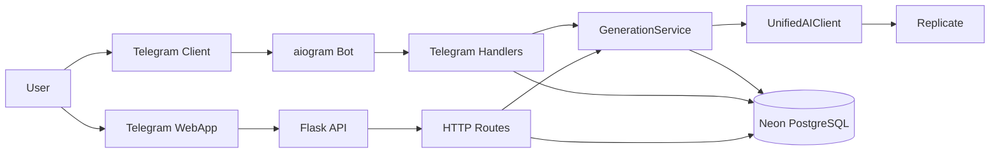

<div align="center">

# AZAMAT AI Hub

**Your AI studio lives inside the chat.**

AI images, video and music inside Telegram — one bot, dozens of models,
agent-grade architecture, native Telegram Stars payments.

[](https://github.com/alivsch-ai-code/flux-bot-azamat/actions/workflows/ci.yml)
[](https://www.python.org/)
[](LICENSE)
[](https://core.telegram.org/bots)

[Website](https://alivsch-ai-code.github.io/flux-bot-azamat/) ·
[Documentation](#documentation) ·
[Quick start](#quick-start) ·
[Research](research/) ·
[Contributing](CONTRIBUTING.md)

</div>

---

## What is this?

**AZAMAT AI Hub** is an open-source **Telegram bot** that turns your chat into a full **AI creative studio**. Generate images from text (text-to-image), videos, music, voice clones, and chat with LLMs — all inside Telegram. No app switching, no complicated UIs. Just message the bot or open its Mini App.

Perfect for developers who want a **ready-made AI bot** for Telegram, or anyone building **image generation**, **video generation**, or **AI chatbot** projects with a modern stack.

---

## Key Features

| Feature | Description |
|---------|-------------|
| 🎨 **AI Image Generation** | **Flux**, **Flux Pro**, **DALL·E 3**, **Stable Diffusion** — text-to-image, image-to-image, inpainting |
| 🎬 **AI Video Generation** | **Kling (via Replicate model integrations)**, **Wan**, **HunyuanVideo** — create videos from prompts or images |
| 🎙️ **AI Audio & Voice** | Music generation, voice cloning, text-to-speech |
| 💬 **AI Chat & LLMs** | **Gemini** for group chat, full LLM support for direct messages |
| 🌐 **Telegram Mini App** | Beautiful in-app web interface — browse models, buy credits, manage settings |
| 👥 **Group Chat Mode** | Add the bot to groups: chat with Gemini, buy credits, set language per group |
| ⏱️ **Chat message batching** | Private & group text chat: debounced replies (20s → 10s → 5s → 10s; flush on 5th message) so bursts get one coherent answer |
| 💳 **Telegram Stars (XTR)** | Native payments — no external payment providers needed |
| 🌍 **Multilingual** | German, English, Russian, Kazakh — full i18n |
| 🔌 **Replicate + OpenAI + Gemini** | Pluggable AI backends, easy to add new models |

---

## Documentation

**Start here:** 🌐 [Project website](https://alivsch-ai-code.github.io/flux-bot-azamat/) (overview) → [Quick Start](#quick-start) (run it) → guides below (go deep).

| Topic | Document |
|-------|----------|
| 🏛️ **Architecture** (layers, components) | [doc/architecture.md](doc/architecture.md) |
| 🧩 **System block diagram** (data flow) | [doc/system_block_diagram.md](doc/system_block_diagram.md) |
| 📋 **Use cases & interfaces** (handlers, HTTP routes, services — German, detailed) | [doc/use_cases_und_schnittstellen.md](doc/use_cases_und_schnittstellen.md) |
| 🚀 **Deploy on Render** | [doc/render_deploy.md](doc/render_deploy.md) |
| 🚂 **Deploy on Railway** | [doc/railway_deploy.md](doc/railway_deploy.md) |
| 📈 **Scaling on Render** | [doc/skalierbarkeit_render.md](doc/skalierbarkeit_render.md) |
| 📢 **Broadcast channels / Daily News** | [doc/telegram_channels.md](doc/telegram_channels.md) |
| 🍔 **Menu modes & structure** | [doc/menu_modes.md](doc/menu_modes.md) · [doc/menu_structure_analysis.md](doc/menu_structure_analysis.md) |
| 🛡️ **Performance & security hardening** | [doc/perf_security_hardening_2026_04.md](doc/perf_security_hardening_2026_04.md) |
| 🔍 **Project audit** | [doc/projekt_audit_2026.md](doc/projekt_audit_2026.md) |
| 🧪 **Tests documentation** | [doc/tests_dokumentation.md](doc/tests_dokumentation.md) |
| 🤖 **Replicate schema & UX audit** | [doc/replicate_schema_ux_audit_2026_04.md](doc/replicate_schema_ux_audit_2026_04.md) |

---

## Tech Stack

- **Bot:** [pyTelegramBotAPI](https://github.com/eternnoir/pyTelegramBotAPI)
- **AI:** [Replicate](https://replicate.com) (Flux, Kling, Hunyuan, etc.), OpenAI (DALL·E), Google Gemini
- **DB:** PostgreSQL ([Neon](https://neon.tech))
- **Web:** Flask, Waitress
- **Deploy:** Render, Railway

---

## Quick Start

```bash
git clone https://github.com/alivsch-ai-code/flux-bot-azamat.git
cd flux-bot-azamat

pip install -r requirements.txt

# Create .env (see Configuration below)
cp .env.example .env

python main.py
```

---

## Configuration

| Variable | Required | Description |
|----------|----------|-------------|
| `TELEGRAM_TOKEN` | ✓ | From [@BotFather](https://t.me/BotFather) |
| `REPLICATE_API_TOKEN` | ✓ | From [replicate.com](https://replicate.com) |
| `DATABASE_URL` | ✓ | PostgreSQL connection string (e.g. [Neon](https://neon.tech)); also stores optional **channel** metadata table `telegram_channels` (Daily News opt-in) |
| `APP_URL` | (WebApp) | HTTPS base URL for Mini App, e.g. `https://xxx.onrender.com` |
| `OPENAI_API_KEY` | (Optional) | For DALL·E / GPT models |
| `ADMIN_ID` | (Optional) | Telegram user ID for admin commands |
| `REPLICATE_MAX_CONCURRENT` | | Max parallel Replicate requests (default: 1) |

**Daily News (DB):** Optional `daily_posts` rows by date. `message_text` can be a single HTML string or JSON `{"de":"…","en":"…","ru":"…","kk":"…"}` for per-user language. Example: `python archive/legacy_tools/seed_daily_alexa_plus_tomorrow.py` (requires `DATABASE_URL`).

---

## Ops & Security Notes
- Flask/WebApp: bei unerwarteten Fehlern geben APIs an Clients nur `error="internal_error"` zurück; die Details stehen in den Server-Logs.
- CI: GitHub Actions testet jetzt mit Python **3.12**.
- DB: `DatabaseManager` sorgt zuverlässig dafür, dass Connections auch bei Exceptions wieder an den Pool zurückgegeben werden (verhindert Pool-„Lecks“ im Fehlerfall).
- Replicate-Audit (Schema + UX + Tests): siehe [`doc/replicate_schema_ux_audit_2026_04.md`](doc/replicate_schema_ux_audit_2026_04.md).
- HTTP-Ratelimits (DDoS-/Burst-Schutz) für `/api/*` inkl. verschärfter Limits auf Upload-/Action-Endpunkten; Antwort bei Überschreitung: `429` + `Retry-After`.
- WebApp-Assets unter `/webapp/assets/*` werden mit `Cache-Control: immutable` ausgeliefert (schnelleres Laden auf Mobilgeräten).

---

## Project Structure

```
flux-bot-azamat/
├── main.py                 # Entry: Flask + Telegram polling
├── webapp-react/           # Vite + React Mini App (build → dist/, served under /webapp)
├── archive/                # Unused providers + legacy operator tools (see archive/README.md)
├── src/
│   ├── application/        # GenerationService, business logic
│   ├── domain/             # Entities, interfaces
│   ├── infrastructure/     # DB, Replicate, OpenAI adapters
│   ├── presentation/       # Telegram handlers, HTTP routes (Mini-App API), keyboards
│   │   ├── http/           # Flask routes for /webapp and /api/*
│   │   └── telegram/handlers/
│   │       ├── group_handler.py   # Groups: Gemini chat, credits, language
│   │       ├── chat_debounce.py   # Batched text chat (timers, flush callback)
│   │       ├── menu_handler.py    # Menu, settings, WebApp actions
│   │       ├── payment_handler.py # Shop, Telegram Stars invoices
│   │       └── gen/               # Generation, navigation, media
│   ├── config/
│   └── utils/               # i18n strings, validation
└── doc/                     # Deployment guides, architecture, telegram_channels.md (Broadcast / Daily News)
```

---

## Menu Modes

| Mode | Description |
|------|-------------|
| `commands` | Classic: `/start`, `/shop` + inline buttons |
| `keyboard` | Reply keyboard with category buttons |
| `webapp` | Telegram Mini App — single UI for everything |

**Admin:** `/set_menu_mode commands|keyboard|webapp`

For WebApp mode, set `APP_URL` and whitelist the domain in [@BotFather](https://t.me/BotFather).

---

## Group Mode

When added to a **group**:

- **Chat:** Gemini-powered AI chat with a fun, cheeky personality
- **Credits:** Buy via inline buttons → DM with shop
- **Language:** Set DE, EN, RU, KK per group
- **Welcome:** One-time personalized greeting DM (AI-generated) for each new user
- **Burst replies:** Multiple quick messages are merged: wait 20s after the first, then shorter windows after each new line (10s / 5s / 10s); the **5th message in a row** forces an immediate reply that addresses the whole batch (same behavior in private text chat mode)

---

## Broadcast channels (Daily News)

Register a **Telegram broadcast channel** for **Azamat AI News** using the same Neon DB as everything else (`telegram_channels` table).

| Step | Command (posted **in the channel**) | Purpose |
|------|-------------------------------------|---------|
| 1 | `/azamat_take_channel_as_group` or `/azamat_take_channel_as_group de` | Store channel metadata + language (`de` / `en` / `ru` / `kk`). |
| 2 | `/azamat_post_daily` | Enable `receive_daily_news` for that channel and run one news round. |

**Requirements:** `DATABASE_URL`, `ADMIN_ID` matching your Telegram user id, bot added as **admin** to the channel. Channel posts use Telegram’s `channel_post` updates; post commands **with your user profile visible** as author (not “channel-only” signature), or the bot cannot verify `ADMIN_ID`.

**Full guide (German):** [doc/telegram_channels.md](doc/telegram_channels.md)

---

## Use cases

| Scenario | What happens |
|----------|----------------|
| **Creative generation** | User picks image/video/audio model → sends prompt (and optional media) → Stars are charged → result is delivered in chat. |
| **Private LLM chat** | User enables chat for a text model or sends plain text from the home screen → history is stored (with periodic summarization) → answers respect the full thread; rapid multi-line typing is batched (see Group Mode). |
| **Mini App** | User opens the Web App from the menu → browses models, buys packages, changes settings; actions call the Flask API with signed `init_data`. |
| **Group collaboration** | Members talk to AZAMAT; each burst is one API call; credits use group-aware rules on the paying user. |
| **Ops / admin** | Switch menu mode, reload models, optional cheat/test flows — see code and `ADMIN_ID`. |

For a **German, detailed** breakdown (handlers, HTTP routes, `GenerationService`, debounce API), see **[doc/use_cases_und_schnittstellen.md](doc/use_cases_und_schnittstellen.md)**.

---

## Interfaces (overview)

| Layer | Interface | Notes |
|-------|-----------|--------|
| **Telegram** | pyTelegramBotAPI handlers | Order: `group_handler` → `menu_handler` → `payment_handler` → `gen_handler`. Group text is **not** handled by `prompt_handlers` (early return). |
| **HTTP** | Flask in `main.py` + `src/presentation/http/http_routes.py` | `/webapp`, `/api/*` — see doc above. |
| **Application** | `GenerationService.process_request(...)` | Credits, validation, routing by model type, Replicate/OpenAI/Gemini via `UnifiedAIClient`. |
| **Domain** | `UserRepository`, `AIProvider` in `src/domain/interfaces.py` | Contracts; `DatabaseManager` + adapters implement behavior. |
| **Chat batching** | `schedule_batched_text_message`, `cancel_pending_batch` | `src/presentation/telegram/handlers/chat_debounce.py` |
| **Chat persistence** | `get_chat_session` / `save_chat_session` | Neon table `chat_sessions` via `src/infrastructure/database.py` (history → Prompt) |

---

## System Block Diagram

Simulink-style Überblick über Datenfluss und Komponenten:



Vollständige Diagramm-Doku: [`doc/system_block_diagram.md`](doc/system_block_diagram.md)

---

## Deployment

- **[Render](doc/render_deploy.md)** — Recommended, web service + health checks
- **[Railway](doc/railway_deploy.md)** — Simple alternative

---

## Replicate Notes

- Offizielle Referenz zum Erstellen von Predictions: [Replicate Create Prediction](https://replicate.com/docs/topics/predictions/create-a-prediction)
- Input-Files (Datei-Uploads, File URLs, Limits): [Replicate Input Files](https://replicate.com/docs/topics/predictions/input-files)
- HTTP-API Details: [Replicate HTTP API](https://replicate.com/docs/reference/http)

---

## Research Roadmap — Toward an Agentic AZAMAT

Today AZAMAT is a **menu-driven generation hub**: the user picks a model, sends a prompt, gets a result. The next evolution — inspired by agent frameworks like [OpenClaw](https://github.com/openclaw/openclaw) — is a bot that **plans, acts and remembers on its own**: you describe a goal ("make a logo for my café, animate it, add a jingle") and the bot orchestrates every step. The roadmap below maps each capability to the research that defines the state of the art.

| Phase | Capability | Key research | Status |
|-------|-----------|--------------|--------|
| **1** | **Autonomous tool selection** — the bot reasons about *which* model fits the request instead of requiring menu navigation; interleaved reasoning + acting loop | ReAct ([Yao et al., 2022](https://arxiv.org/abs/2210.03629)) · Toolformer ([Schick et al., 2023](https://arxiv.org/abs/2302.04761)) | 🔬 planned |
| **2** | **Multi-step planning** — decompose "logo → animation → music" into an executed pipeline with intermediate results passed between models | Tree of Thoughts ([Yao et al., 2023](https://arxiv.org/abs/2305.10601)) · Plan-and-Solve ([Wang et al., 2023](https://arxiv.org/abs/2305.04091)) | 🔬 planned |
| **3** | **Long-term memory** — evolve `chat_sessions` + summarization into hierarchical memory: user preferences, past generations, style profiles that persist across sessions | MemGPT ([Packer et al., 2023](https://arxiv.org/abs/2310.08560)) · Generative Agents ([Park et al., 2023](https://arxiv.org/abs/2304.03442)) | 🌱 foundation exists |
| **4** | **Self-reflection & skill learning** — learn from failed generations (retry with improved prompts), build a growing library of proven prompt/parameter "skills" | Reflexion ([Shinn et al., 2023](https://arxiv.org/abs/2303.11366)) · Voyager ([Wang et al., 2023](https://arxiv.org/abs/2305.16291)) | 🔬 planned |
| **5** | **Open tool ecosystem** — auto-discover Replicate model schemas as callable tools; expose the bot's capabilities via [Model Context Protocol](https://modelcontextprotocol.io) so external agents can use AZAMAT as a tool | ToolLLM ([Qin et al., 2023](https://arxiv.org/abs/2307.16789)) · Gorilla ([Patil et al., 2023](https://arxiv.org/abs/2305.15334)) | 🌱 schema sync exists |
| **6** | **Evaluation & guardrails** — benchmark agent decisions, enforce credit budgets on autonomous actions, require confirmation above spend thresholds | AgentBench ([Liu et al., 2023](https://arxiv.org/abs/2308.03688)) · Agent survey ([Wang et al., 2023](https://arxiv.org/abs/2308.11432)) | 🔬 planned |

**Why this order?** Tool selection (1) and planning (2) deliver the biggest UX jump and build directly on the existing `GenerationService` routing. Memory (3) extends infrastructure that already exists (`chat_sessions`, summarization, dynamic model schemas in `ai_models`). Reflection (4) and the open ecosystem (5) turn the bot from a product into a platform. Guardrails (6) run alongside every phase — an agent that spends user credits autonomously must be budget-aware from day one.

**Runnable prototypes** for phases 1–3 live in [`research/`](research/) — standalone, deterministic, zero API keys:

```bash
python research/01_react_tool_selection/prototype.py   # ReAct: intent -> model
python research/02_pipeline_planner/prototype.py       # goal -> budgeted multi-step plan
python research/03_hierarchical_memory/prototype.py    # MemGPT-style memory tiers
```

Contributions to any phase are welcome — see [CONTRIBUTING.md](CONTRIBUTING.md).

---

## Contributing

Contributions are welcome! Please read **[CONTRIBUTING.md](CONTRIBUTING.md)** for the development setup, project layout and conventions. In short: run `pytest` and `ruff check` before opening a PR, and keep changes in the right architecture layer.

---

## License

This project is licensed under the **MIT License** — see [LICENSE](LICENSE) for details.
