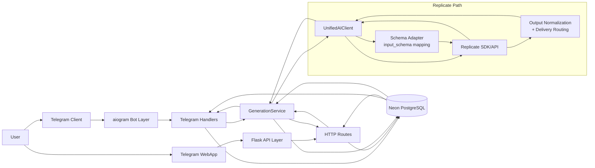

# System Block Diagram (Simulink-style)

Dieses Blockdiagramm zeigt den End-to-End-Datenfluss des Bots mit Telegram, WebApp, Flask-API, Service-Layer, Replicate und Neon.

## Kurzbeschreibung

- **Telegram/WebApp** sind zwei Frontends für denselben Kern.
- **GenerationService** ist die zentrale Anwendungslogik (Kosten, Prompt-Flow, Weiterleitung).
- **UnifiedAIClient** kapselt Provider-Details (v. a. Replicate).
- **Neon DB** hält Nutzer, Modelle (`ai_models` inkl. Input/Output-Schema), Einstellungen und Betriebsdaten.

